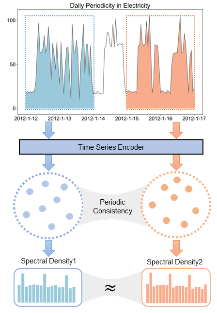
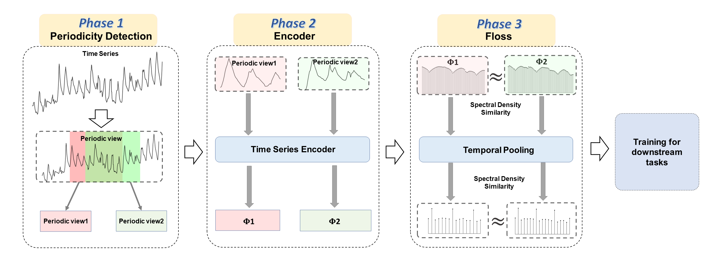

# Enhancing Representation Learning for Periodic Time Series with Floss: A Frequency Domain Regularization Approach

## Overview 

Time series analysis is a fundamental task in various application domains, and deep learning approaches have demonstrated remarkable performance in this area. However, many real-world time series data exhibit significant periodic or quasi-periodic dynamics that are often not adequately captured by existing deep learning-based solutions. This results in an incomplete representation of the underlying dynamic behaviors of interest. To address this gap, we propose an unsupervised method called Floss that automatically regularizes learned representations in the frequency domain. The Floss method first automatically detects major periodicities from the time series. It then employs periodic shift and spectral density similarity measures to learn meaningful representations with periodic consistency. In addition, Floss can be easily incorporated into both supervised, semi-supervised, and unsupervised learning frameworks. We conduct extensive experiments on common time series classification, forecasting, and anomaly detection tasks to demonstrate the effectiveness of Floss. We incorporate Floss into three representative deep learning solutions to justify our design choices and demonstrate that it is capable of automatically discovering periodic dynamics and improving state-of-the-art deep learning models.
<p align="center">
    
</p>


## Key idea of Floss

In our research, we address the problem of analyzing periodic time series data, denoted as $\mathcal{X} \in \mathbb{R}^{N \times T \times F}$. Here, $N$ represents the number of time series, $T$ is the time window size, and $F$ is the feature dimension. We assume that the time series exhibit periodic behavior, and the periodicities may vary within the sampled time ranges.

To represent the time series, we use a model $\mathcal{G}$ with parameters $\mathbf{\theta}$ to generate a representation tensor $\mathcal{Y} = \mathcal{G}(\mathcal{X}; \mathbf{\theta})$. The goal is to capture the underlying periodic nature of time series in these learned representations.

To achieve this, we propose the Frequency Domain Loss (Floss). Floss consists of two main steps: periodicity detection and a novel loss objective. First, we detect the prominent periodicity $\hat{p}_{[t_1,t_2]}$ within each time series sampled from $\mathcal{X}_{[t_1,t_2]}$. Then, we create periodic views of the time series by shifting the data along the time axis.

The loss function $\mathcal{L}_f$ compares the power spectral density of the original and periodic views. However, to better capture information from all frequency components, we introduce a hierarchical frequency loss. We apply temporal max pooling to the learned representations $\mathcal{Y}$ and $\hat{\mathcal{Y}}$ and calculate the periodic invariance loss at multiple scales.

By minimizing the loss function, the representations of the original and periodic views exhibit similarity within specific domains, enabling the identification of similar periodic patterns. Floss enhances the understanding of the periodic nature of time series and can be applied to downstream tasks effectively.

<p align="center">
    
</p>

**Overview of Floss approach.** our model has three key phases: periodicity detection, encoder and Floss. 
1. **Periodicity Detection:** In this phase, we detect the prominent periodicity $\hat{p}{\left[t_1,t_2\right]}$ within each time series sampled from $\mathcal{X}{\left[t_1,t_2\right]}$. By analyzing the power spectral density, we identify the dominant periodic behavior and account for varying periodicities within the sampled time ranges.

2. **Encoder:** In the encoder phase, we use a model $\mathcal{G}$ with learnable parameters $\mathbf{\theta}$ to generate a representation tensor $\mathcal{Y} = \mathcal{G}\left(\mathcal{X}; \mathbf{\theta}\right)$. This encoder process transforms the input time series into meaningful representations that capture the periodic invariance.

3. **Frequency Domain Loss (Floss):** Floss is a novel loss objective that serves as the core component of our model. It involves comparing the power spectral density of the original time series representation $\mathcal{Y}$ with the representation of its periodic view $\hat{\mathcal{Y}}$. By minimizing the loss function, the representations of the original and periodic views exhibit similarity within specific frequency domains, enabling the identification of similar periodic patterns.

By combining these three phases, our model effectively learns to encode the underlying periodicity of time series data in the representations, providing valuable insights into periodic behavior that can be applied to downstream tasks with improved accuracy and understanding.

Specifically, in the TS_TCC and TS2vec, we first identify time series with periodic variations and then extract their representations. However, in the Informer and PatchTST baselines, we extract representations that capture periodic variations from the entire set of features.


## Baselines

We have conducted an evaluation of the Floss on four baseline models: Informer, PatchTST, TS2vec, and TS-TCC. 

Please find detailed information on the implementation and setup of each baseline model in their respective folder's readme files. The baseline models' folders are as follows:

1. [Informer](./Informer)
2. [PatchTST](./PatchTST)
3. [TS2vec](./TS2vec)
4. [TS-TCC](./TS_TCC).


## Code example

```python

def hierarchical_contrastive_loss(z1, z2, alpha=0, k = 2, f_weight=1, temporal_unit=0, beta=0.5, trans_type='dct'):
    loss = torch.tensor(0., device=z1.device)
    d = 0
    while z1.size(1) > 1:
        if alpha != 0:
            loss += alpha * instance_contrastive_loss(z1, z2)
        if d >= temporal_unit:
            if trans_type == 'dct':
                loss += beta * freqency_loss(z1, z2)
            elif trans_type == 'fft':
                loss += beta * periogram_loss(z1, z2)
        d += 1
        z1 = F.max_pool1d(z1.transpose(1, 2), kernel_size=k).transpose(1, 2)
        z2 = F.max_pool1d(z2.transpose(1, 2), kernel_size=k).transpose(1, 2)
    if z1.size(1) == 1:
        if alpha != 0:
            loss += alpha * instance_contrastive_loss(z1, z2)
        d += 1
    return loss / d * f_weight


def instance_contrastive_loss(z1, z2):
    B, T = z1.size(0), z1.size(1)
    if B == 1:
        return z1.new_tensor(0.)
    z = torch.cat([z1, z2], dim=0)  # 2B x T x C
    z = z.transpose(0, 1)  # T x 2B x C
    sim = torch.matmul(z, z.transpose(1, 2))  # T x 2B x 2B
    logits = torch.tril(sim, diagonal=-1)[:, :, :-1]  # T x 2B x (2B-1)
    logits += torch.triu(sim, diagonal=1)[:, :, 1:]
    logits = -F.log_softmax(logits, dim=-1)

    i = torch.arange(B, device=z1.device)
    loss = (logits[:, i, B + i - 1].mean() + logits[:, B + i, i].mean()) / 2
    return loss


def temporal_contrastive_loss(z1, z2):
    B, T = z1.size(0), z1.size(1)
    if T == 1:
        return z1.new_tensor(0.)
    z = torch.cat([z1, z2], dim=1)  # B x 2T x C
    sim = torch.matmul(z, z.transpose(1, 2))  # B x 2T x 2T
    logits = torch.tril(sim, diagonal=-1)[:, :, :-1]  # B x 2T x (2T-1)
    logits += torch.triu(sim, diagonal=1)[:, :, 1:]
    logits = -F.log_softmax(logits, dim=-1)

    t = torch.arange(T, device=z1.device)
    loss = (logits[:, t, T + t - 1].mean() + logits[:, T + t, t].mean()) / 2
    return loss


def freqency_loss(z1, z2):
    o1 = z1.permute( [0, 2, 1])
    o2 = z2.permute([0, 2, 1])
    return torch.mean(torch.abs(torch.abs(dct(o1)) - torch.abs(dct(o2))))


def periogram_loss(z1, z2):
    o1 = z1.permute([0, 2, 1])
    o2 = z2.permute( [0, 2, 1])
    return torch.mean(torch.abs((p_fft(o1)) - (p_fft(o2))))


```
In the hierarchical_contrastive_loss function, you can adjust the hyperparameters alpha, beta, and f_weight to achieve the best performance. 

## Miscellaneous

Please send any questions you might have about the code and/or the algorithm to <ycwcw123@gmail.com>. 


## License

This work is released under the MIT license.


